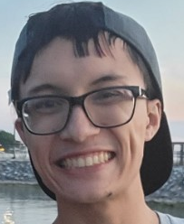

# User Page


## About Me

Hello! My name is Ryan, and I am currently a third-year CS major at UCSD.

## Interests

- Game development
- Making music
- Drawing/sketching things

## Favorite Programming Languages

1. Python
2. C#
3. Java

```
print("Hello world!")
```

## Famous Quote

**Paul McCartney:** *Speaking words of wisdom...*
> *Let it be.*

## Good Resources
[Git Commands (link here)](http://guides.beanstalkapp.com/version-control/common-git-commands.html)

[Git Markdown (link here)](https://docs.github.com/en/github/writing-on-github/getting-started-with-writing-and-formatting-on-github/basic-writing-and-formatting-syntax)

## Neighbors

[Readme File](README.md)

[Me File](picture_of_me.PNG)

## Summary

[About Me](#about-me)

[Interests](#interests)

[Favorite Programming Languages](#favorite-programming-languages)

[Famous Quote](#famous-quote)

[Good Resources](#good-resources)

[Neighbors](#neighbors)

## Tasks
- [x] Headings
- [x] Style Text
- [x] Quoting Text
- [x] Quoting Code
- [x] External Links
- [x] Section Links
- [x] Relative Links
- [x] Lists
- [x] Task Lists
- [ ] *Empty*